## 使用RPC构建高并发web应用

> 声明：部分插图来源于互联网

#### 目录：
1. RPC概述
2. Redis文本协议
3. Protobuf协议
4. gRPC实践

### 1. 什么是 RPC ？
RPC (Remote Procedure Call)即远程过程调用。除 RPC 之外，常见的多系统数据交互方案还有分布式消息队列、HTTP 请求调用、数据库和分布式缓存等。

RPC 是两个子系统之间进行的直接消息交互，它使用操作系统提供的套接字来作为消息的载体，以特定的消息格式来定义消息内容和边界。

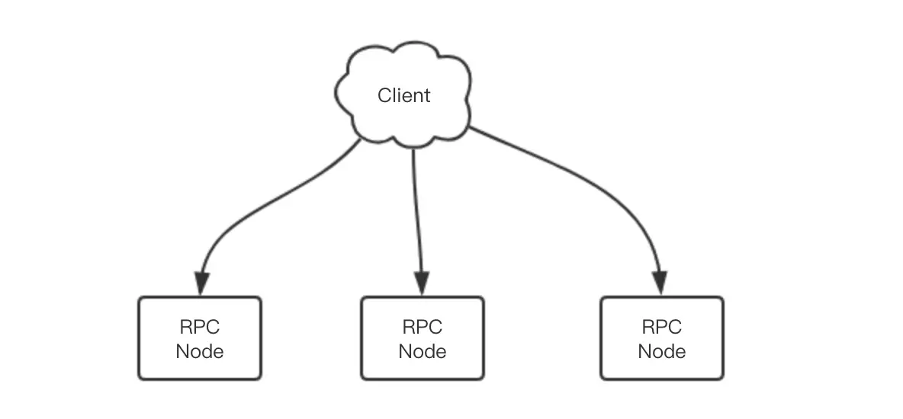

现代企业的关键性 RPC 服务是绝不可以只使用单点部署的。对 RPC 服务进行分布式化，使得服务可以容忍个别节点故障仍能继续对外提供服务。

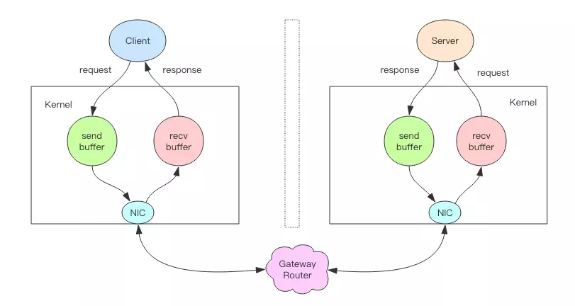

#### * 容灾 Failover与降权
比如当节点挂掉时，将失效节点摘除，放置到失效节点列表中。然后每隔一段时间检查失效节点是否恢复了，如果恢复了，那就从失效节点中移除，再将节点地址重新加入到有效节点列表中：
1. 常用时间窗口降权法，统计在一定时间窗口里出现的错误数量，过大则降权
2. 不降到零，那是为了给节点提供一个恢复的机会。
3. 被降权的节点后来只要有一次调用成功，那么 weight 值就应该尽快被还原

一个简单的策略是权重减半法。错误一次权重减半，连续错误两次权重就降到 1/4，如此直到降到最小值。如果初始权重值是 1024，那么权重值就会逐渐衰减```1024=>512=>256=>128=>64=>32=>16=>8=>4=>2=>1```。
如果节点恢复了，那么调用会成功，权重就可以直接恢复到正常值，也可以通过加倍法逐渐恢复到正常值```1=>2=>4=>8=>16=>32=>64=>128=>256=>512=>1024```。
如果希望恢复的更快一点，可以通过乘 4 法，乘 8 法。

#### * 服务发现
健壮的服务应该是可以支持动态扩容的服务。当 RPC 服务节点增加或减少时，客户端可以动态快速收到服务列表的变更信息，从而可以实时调整连接配置，这样无需重启就可以完成服务的扩容和缩容。

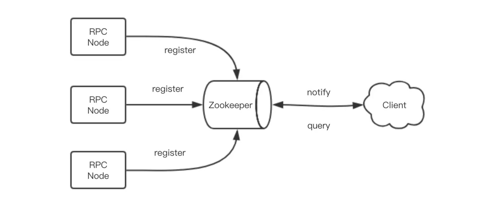

服务发现技术依赖于服务之间的特殊中间节点。这个节点的作用就是接受服务的注册，提供服务的查找，以及服务列表变更的实时通知功能。它一般使用支持高可用的分布式配置数据库作为解决方案，如 zookeeper/etcd 等。

- 服务注册——服务节点在启动时将自己的服务地址注册到中间节点
- 服务查找——客户端启动时去中间节点查询服务地址列表
- 服务变更通知——客户端在中间节点上订阅依赖服务列表的变更事件。当依赖的服务列表变更时，中间节点负责将变更信息实时通知给客户端。

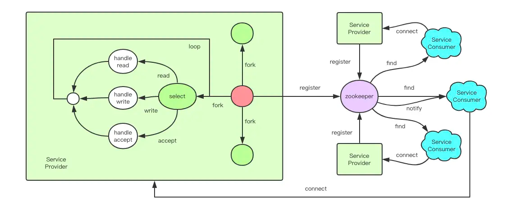

### 2. Redis文本协议 RESP (Redis Serialization Protocol)

对于一串消息流，我们必须能确定消息边界，提取出单条消息的字节流片段，然后对这个片段按照一定的规则进行反序列化来生成相应的消息对象。
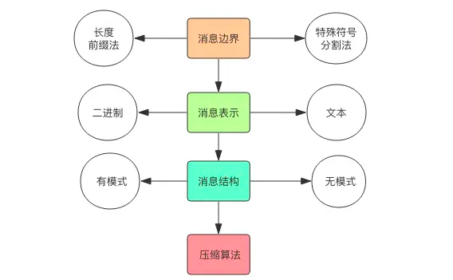

RESP 是 Redis 序列化协议的简写。它是一种直观的文本协议，优势在于实现异常简单，解析性能极好。

Redis 协议将传输的结构数据分为 5 种最小单元类型，单元结束时统一加上回车换行符号\r\n。

1. 单行字符串 以+符号开头；
2. 多行字符串 以$符号开头，后跟字符串长度；
3. 整数值 以:符号开头，后跟整数的字符串形式；
4. 错误消息 以-符号开头；
5. 数组 以*号开头，后跟数组的长度；

单行字符串 hello world
```
+hello world\r\n
```
直观打印如下：
```
+hello world
```
多行字符串 第一行是长度，剩下的是内容，表示字符串 hello world 如下：

```
$11\r\nhello world\r\n
```
直观打印如下：
```
$11
hello world
```
多行字符串当然也可以表示单行字符串。

整数 冒号开头 表示整数 1024 如下：
```
:1024\r\n
```
直观打印如下：
```
:1024
```
错误 减号开头后跟错误名称和详细错误解释 表示「参数类型错误」如下：
```
-WRONGTYPE Operation against a key holding the wrong kind of value\r\n
```
直观打印如下：
```
-WRONGTYPE Operation against a key holding the wrong kind of value
```
数组 第一行是长度，后面依次是每个内容，表示数组 [1,2,3] 如下：
```
*3\r\n:1\r\n:2\r\n:3\r\n
```
直观打印如下：
```
*3
:1
:2
:3
```
数组里面可以嵌套其它类型，甚至可以嵌套另外一个数组，如此就可以形成复杂的数据结构。

NULL 用多行字符串表示，不过长度要写成-1。
```
$-1\r\n
```
直观打印如下：
```
$-1
```
空串 用多行字符串表示，长度填 0。
```
$0\r\n\r\n
```
直观打印如下：
```
$0

```
注意这里有两个\r\n，为什么是两个，因为两个\r\n 之间隔的是空串。

#### 发送指令：客户端 -> 服务器

客户端向服务器发送的指令只有一种格式，多行字符串数组。比如一个简单的 set 指令set author codehole会被序列化成下面的字符串。
```
*3\r\n$3\r\nset\r\n$6\r\nauthor\r\n$8\r\ncodehole\r\n
```
在控制台输出这个字符串如下，可以看出这是很好阅读的一种格式。
```
*3
$3
set
$6
author
$8
codehole
```
#### 发送指令：服务器 -> 客户端
服务器向客户端回复的响应要支持多种数据结构，所以消息响应在结构上要复杂不少。不过再复杂的响应消息也是以上 5 中基本类型的组合。

数组响应
```
127.0.0.1:6379> hgetall info
1) "name"
2) "laoqian"
3) "age"
4) "30"
5) "sex"
6) "male"
```
这里的 hgetall 命令返回的就是一个数值，第 0|2|4 位置的字符串是 hash 表的 key，第 1|3|5 位置的字符串是 value，客户端负责将数组组装成字典再返回。
```
*6
$4
name
$6
laoqian
$3
age
$2
30
$3
sex
$4
male
```
嵌套
```
127.0.0.1:6379> scan 0
1) "0"
2) 1) "info"
   2) "books"
   3) "author"
```
scan 命令用来扫描服务器包含的所有 key 列表，它是以游标的形式获取，一次只获取一部分。

scan 命令返回的是一个嵌套数组。数组的第一个值表示游标的值，如果这个值为零，说明已经遍历完毕。如果不为零，使用这个值作为 scan 命令的参数进行下一次遍历。数组的第二个值又是一个数组，这个数组就是 key 列表。
```
*2
$1
0
*3
$4
info
$5
books
$6
author
```
#### 小结
Redis的协议RESP

1. 消息边界-特殊字符标记法
2. 消息表示-文本
3. 消息结构-显示文本自说明
4. 压缩算法-没用

因为Antirez认为数据库系统的瓶颈不在于网络流量，而在于数据库内部的处理逻辑上。所以，RESP的设计理念是简单、易于理解和使用，消息传输上浪费一些流量并无大碍。

### 3.Protobuf协议
#### (1) zigzag编码
zigzag 编码将整数范围一一映射到自然数范围，然后再进行 varint 编码。
```
0 => 0
-1 => 1
1 => 2
-2 => 3
2 => 4
-3 => 5
3 => 6
```
zigzag 将负数编码成正奇数，正数编码成偶数。解码的时候遇到偶数直接除 2 就是原值，遇到奇数就加 1 除 2 再取负就是原值。

#### (2) varint变长整数编码

保留每个字节的最高位的 bit 来标识是否后面还有字节，1 表示还有字节需要继续读，0 表示到读到当前字节就结束。
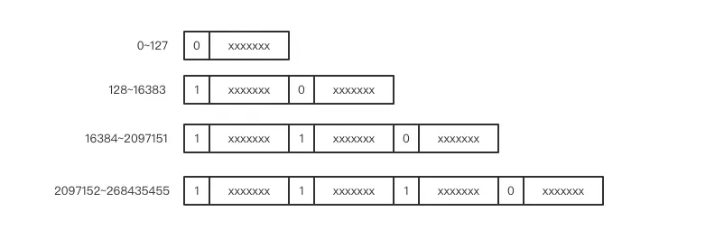
数值非常小时，只需要使用一个字节来存储，数值稍微大一点可以使用 2 个字节，再大一点就是 3 个字节，它还可以超过 4 个字节用来表达长整形数字。

#### (3) protobuf

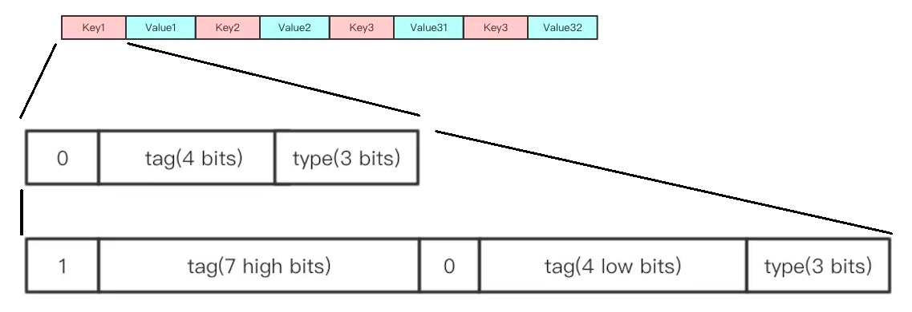
Protobuf 传输的是一系列的键值对，如果连续的键重复了，那说明传输的值是一个列表 (repeated)。图上的 key3 就是一个列表类型 (repeated)。

键 key 两部分组成：tag 和 type。

- tag

  Protobuf 将对象中的每个字段和正数序列 (tag) 对应起来

- type

  Protobuf 将字段类型也和正数序列 (type) 对应起来，每一种原生的 java 类型都唯一对应一个正数，类型信息也非常节省。type 使用 3 个 bits 表示，最多支持 8 种类型。

8 种类型够吗？够！因为一个 zigzag 类型可以表示所有的类整数类型，__byte/short/int/long/bool/enum/unsigned byte/unsigned short/unsigned int/unsigned long__ 这些类型都可以使用 zigzag 表示。而 Python 语言的整数更加特别，它根本就不区分整数的位数，甚至可以是一个 BigInteger。varint 的特长就在于此，它可以无限扩展位数大小，可以表示无限的整数值。而字节数组、字符串和嵌套对象都可以使用一种称之为 length 前缀 (length-delimited) 的类型来表示。另外 float 和 double 类型各占一个类型。最终你看，连 8 个类型都没有使用到。

#### key = tag + type

Protobuf 将字段名称对应的整数 (tag) 和字段类型对应的整数 (type) 合并在一起凑成一个字节。如果字段不够，则可以无限扩展。理论上，它支持无数个字段。

下面我们看 value 部分，value 部分随着类型 type 的不同而具有不同的形式

- 整数
- 浮点数：浮点数分为 float 和 double，它们分别使用 4 个字节和 8 个字节序列化，这两个类型的 value 没有做什么特殊处理，它就是标准的浮点数
- 字符串：长度前缀编码。第一个varint 编码的值是字符串的长度，后面相应长度的字节串就是字符串的内容
- 嵌套： type 同字符串的 type 一样，都是 length 前缀。第一个字节varint 编码的值为字节长度，后面相应长度的字节串就是嵌套对象的整个内容，这部分内容会递归使用 Protobuf 进行编码解码

```
Protobuf ->

message Person {
    required string user_name        = 1;  // 必须字段
    optional int64  favourite_number = 2;  // 可选字段
    repeated string interests        = 3;  // 列表类型
}
-----------------------
js ->

var person = new Person{
    user_name: "Martin",
    favourite_number: 1337,
    interests: ["daydreaming", "hacking"]
}

```
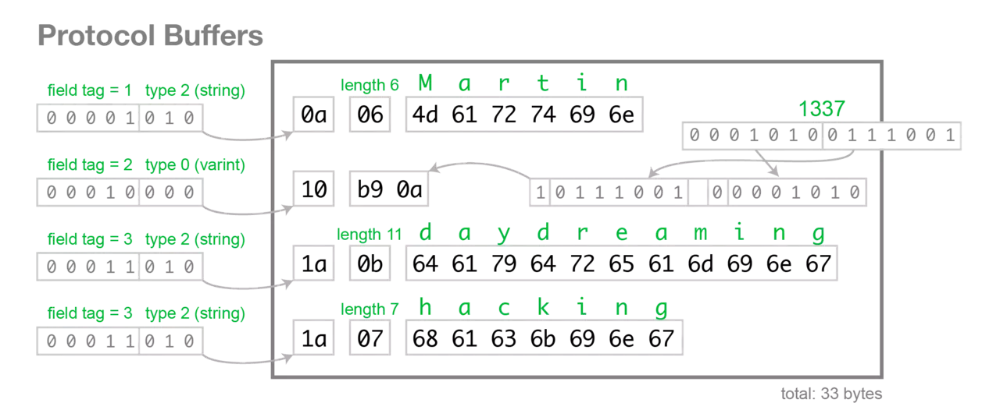

### 4. gRPC实践
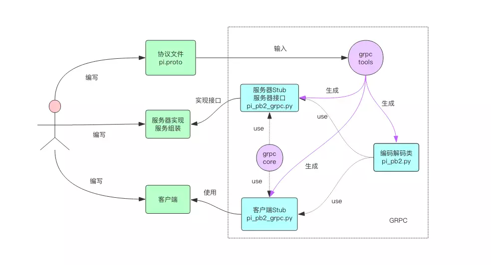

接下来我们使用 GRPC 来实现一下圆周率计算服务。整个过程分为五步

1. 编写协议文件 pi.proto
2. 使用grpc_tools工具将 pi.proto编译成pi_pb2.py和pi_pb2_grpc.py两个文件
3. 使用pi_pb2_grpc.py文件中的服务器接口类，编写服务器具体逻辑实现
4. 使用pi_pb2_grpc.py文件中的客户端 Stub，编写客户端交互代码

首先我们安装一下工具依赖
```
pip install grpcio_tools  # tools 包含代码生成工具，会自动安装依赖的 grpcio 包
```
编写协议文件 pi.proto
```
syntax = "proto3";

package pi;

// pi service
service PiCalculator {
    // pi method
    rpc Calc(PiRequest) returns (PiResponse) {}
}

// pi input
message PiRequest {
    int32 n = 1;
}

// pi output
message PiResponse {
    double value = 1;
}
```
协议文件包含输入消息PiRequest、输出消息PiResponse和 rpc 服务调用的定义PiCalculator

生成代码
```
python -m grpc_tools.protoc -I. --python_out=. --grpc_python_out=. pi.proto
```
这个命令行有很多参数，其中python_out目录指定pi_pb2.py文件的输出路径，grpc_python_out指定pi_pb2_grpc.py文件的输出路径。-I参数指定协议文件的查找目录，我们都将它们设置为当前目录。

Server:
```python
# coding: utf-8
# server.py
import math
import grpc
import time
from concurrent import futures

import pi_pb2
import pi_pb2_grpc


# 圆周率计算服务实现类
class PiCalculatorServicer(pi_pb2_grpc.PiCalculatorServicer):
    def Calc(self, request, ctx):
        # 计算圆周率的逻辑在这里
        s = 0.0
        for i in range(request.n):
            s += 1.0/(2*i+1)/(2*i+1)
        # 注意返回的是一个响应对象
        return pi_pb2.PiResponse(value=math.sqrt(8*s))


def main():
    # 多线程服务器
    server = grpc.server(futures.ThreadPoolExecutor(max_workers=10))
    # 实例化圆周率服务类
    servicer = PiCalculatorServicer()
    # 注册本地服务
    pi_pb2_grpc.add_PiCalculatorServicer_to_server(servicer, server)
    # 监听端口
    server.add_insecure_port('127.0.0.1:8080')
    # 开始接收请求进行服务
    server.start()
    # 使用 ctrl+c 可以退出服务
    try:
        time.sleep(1000)
    except KeyboardInterrupt:
        server.stop(0)


if __name__ == '__main__':
    main()
```
Client：
```python
# coding: utf-8
# client.py

import grpc

import pi_pb2
import pi_pb2_grpc


def main():
    channel = grpc.insecure_channel('localhost:8080')
    # 使用 stub
    client = pi_pb2_grpc.PiCalculatorStub(channel)
    # 调用吧
    for i in range(1, 1000):
        print "pi(%d) =" % i, client.Calc(pi_pb2.PiRequest(n=i)).value


if __name__ == '__main__':
    main()
```

gRPC使用异步io模型：

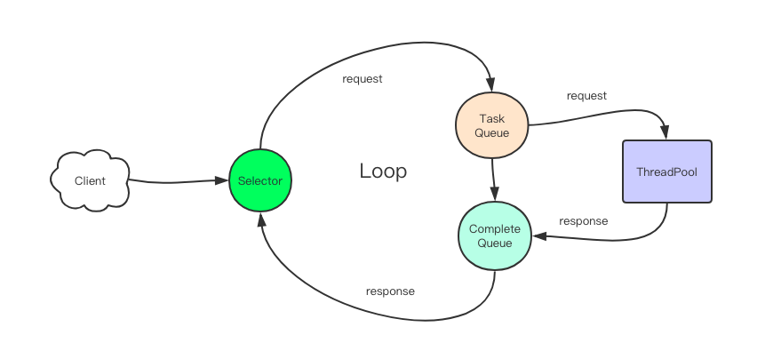
改造一下客户端代码，使用客户端的并行 RPC 调用来计算圆周率。
```python
# multithread_client.py
import grpc

import pi_pb2
import pi_pb2_grpc

from concurrent.futures import ThreadPoolExecutor


def request_2(client):

    def pi(n):
        return client.Calc(pi_pb2.PiRequest(n=n)).value

    s = time.time()
    executor = ThreadPoolExecutor(max_workers=4)

    futures = []
    for i in range(5):
        future = executor.submit(pi, i)
        futures.append(future)
    executor.shutdown(True)
    print(f"request 2 cost: {time.time() - s:.3f}")
    for future in futures:
        print(future.result())

def main():
    channel = grpc.insecure_channel('localhost:8080')
    # client 对象是线程安全的
    client = pi_pb2_grpc.PiCalculatorStub(channel)
    # 客户端使用线程池执行
    request_2()	


if __name__ == '__main__':
    main()
```

同时可以开启Streaming 模式

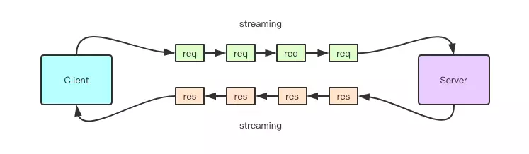
协议文件：
```protobuf
syntax = "proto3";

package pi;

// pi service
service PiCalculator {
  // pi method
  rpc Calc(stream PiRequest) returns (stream PiResponse) {}
}

// pi input
message PiRequest {
  int32 n = 1;
}

// pi output
message PiResponse {
  int32  n = 1;
  double value = 2;
}
```
Server:
```python
def Calc(self, request_iterator, ctx):
  # request 是一个迭代器参数，对应的是一个 stream 请求
  for request in request_iterator:
    # 50% 的概率会有响应
    if random.randint(0, 1) == 1:
      continue

    s = 0.0
    for i in range(request.n):
      s += 1.0 / (2 * i + 1) / (2 * i + 1)
    # 响应是一个生成器，一个响应对应对应一个请求
    yield pi_pb2.PiResponse(n=i, value=math.sqrt(8 * s))
```
client:
```python
def generate_request():
  for i in range(1, 1000):
    yield pi_pb2.PiRequest(n=i)

    response_iterator = client.Calc(generate_request())
    for response in response_iterator:
      print "pi(%d) =" % response.n, response.value
```

处理异常
```python
def Calc(self, request, ctx):
  if request.n <= 0:
    ctx.set_code(grpc.StatusCode.INVALID_ARGUMENT)  # 参数错误
    ctx.set_details("request number should be positive")  # 错误具体说明
    return pi_pb2.PiResponse()
  s = 0.0
  for i in range(request.n):
    s += 1.0/(2*i+1)/(2*i+1)
  return pi_pb2.PiResponse(value=math.sqrt(8*s))
```
