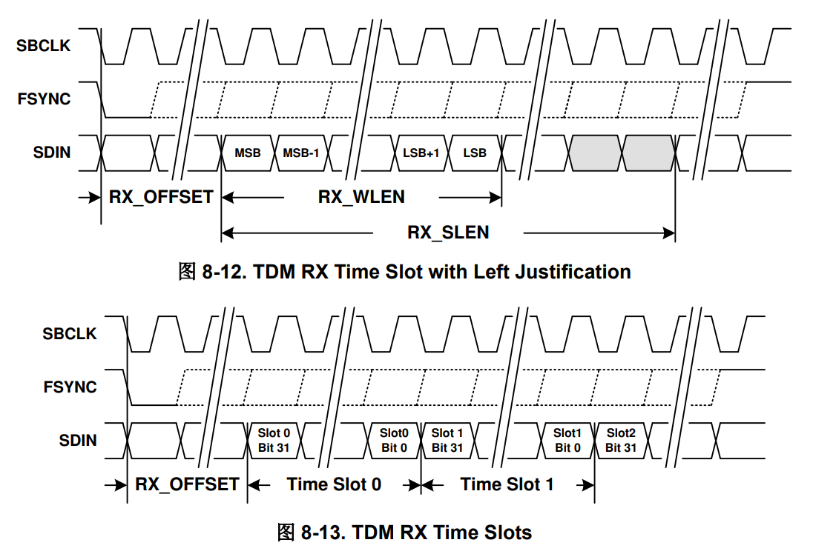
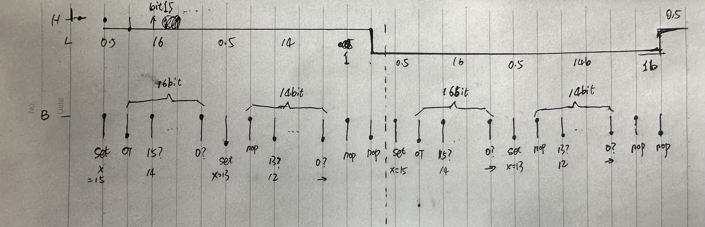
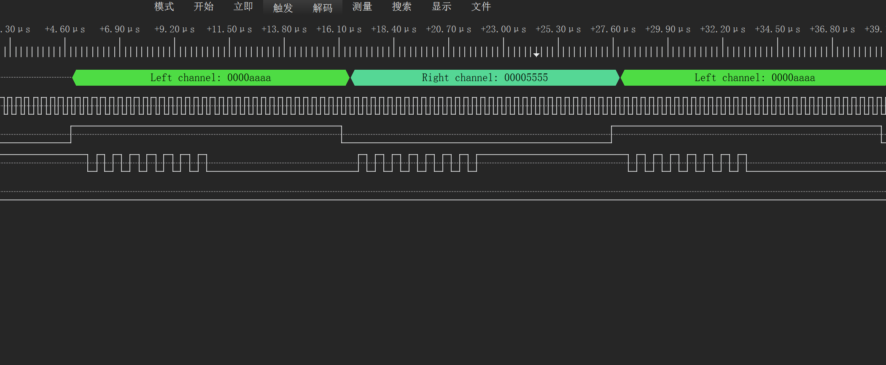
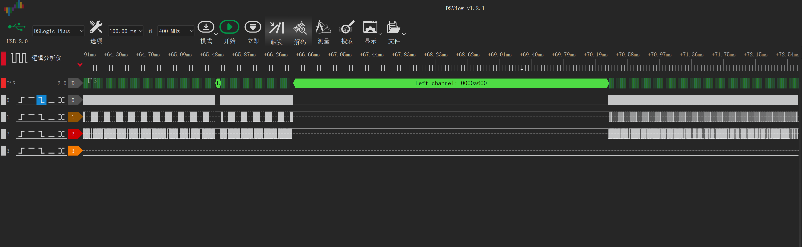

## 目录

* [TAS2563](#TAS2563)
* [RP2040实现IIS](#RP2040-IIS)
* [时隙太小，很难不间断的传输数据](#time-slot)
* [总结](#summary)

最近使用tas2563做一个音频相关的项目，想要快速验证方案，就选了用了rp2040作为主控。主要的考量是，rp2040官方加入了MicroPython的支持，在开发上占据一定的便利性。

<h2 id="TAS2563">TAS2563</h2>

tas2563是德州仪器的一款6瓦单声道D类功放，自带DC-DC升压，在2.5v~5.5v电池供电的情况下升至11v，同时有着极高的信噪比和低失真度。它的音频数据接口为TDM，可以配置为标准IIS或者左对齐模式。数据手册中采样率相关的介绍：



> The TDM serial audio port supports up to 16 32-bit time slots at 44.1/48 kHz, 8 32-bit time slots at a 88.2/96 kHz sample rate and 4 32-bit time slots at a 176.4/192 kHz sample rate. The device supports 2 time slots at 32 bits in width and 4 or 8 time slots at 16, 24 or 32 bits in width. Valid SBCLK to FSYNC ratios are 64, 96, 128, 192, 256, 384 and 512. The device will automatically detect the number of time slots and this does not need to be programmed.

其中规定了SBCLK和FSYNC最低的时钟比是64，即每一帧数据至少要达到64bit，哪怕传输24bit（双声道48bit，后同理）、16bit甚至是8bit音频，也要在末尾添补0来凑齐64个时钟。这其实是个缺点，因为它强行拉高了SBCLK的时钟频率，进而也拉高了主控的时钟。

tas2563的采样率最高支持96kHz，但过高的时钟频率对主控投喂数据的实效要求更高。通常认为44.1kHz的采样率已经有足够的声音表现。鉴于其总线要求，在这个采样率下，SBCLK的频率为2.8224Mhz，如果传输16bit音频，码率为1378 kbps，约172.3 KB/s。

<h2 id="RP2040-IIS">RP2040实现IIS</h2>

rp2040没有IIS外设接口，但有两个PIO块，每个PIO块有4个状态机，共享32个槽位的指令缓存。实现一个IIS接口，使用1个状态机就够了。由于每条指令占用一个状态机时钟，可以画出标准32bit IIS时序图：

对应的程序如下：
```python
@asm_pio(out_init=PIO.OUT_LOW, sideset_init=(PIO.OUT_HIGH, PIO.OUT_HIGH), pull_thresh=32, autopull=True, fifo_join=PIO.JOIN_TX,)
def Audio_PIO():
    # SBCLK active: rising edge
    #                              _ FSYNC
    #                             / _ SBCLK
    #                             |/
    set(x, 15)            .side(0b11)
    label("high_ch")
    out(pins, 1)          .side(0b10)
    jmp(x_dec,"high_ch")  .side(0b11)

    set(x, 13)            .side(0b10)
    label("high_nop")
    nop()                 .side(0b11)
    jmp(x_dec,"high_nop") .side(0b10)
    nop()                 .side(0b11)
    nop()                 .side(0b00)

    set(x, 15)            .side(0b01)
    label("low_ch")
    out(pins, 1)          .side(0b00)
    jmp(x_dec,"low_ch")   .side(0b01)

    set(x, 13)            .side(0b00)
    label("low_nop")
    nop()                 .side(0b01)
    jmp(x_dec,"low_nop")  .side(0b00)
    nop()                 .side(0b01)
    nop()                 .side(0b10)
```

在主循环中，往状态机中的tx FIFO写入数据0xAAAA_5555，左右声道各16bit ，从逻辑分析仪可以看到标准信号：


实现了这一步，已经可以让tas2563发出声音了。但如果要让它播放歌曲，才是最困难的一步。如果所有音频都存储于ROM，那直接读取就好，几乎没有任何障碍。但这是不现实的，rp2040最大仅支持16MB的ROM，如果以wav格式存储44.1kHz 16bit音频，最多也只能存90秒。所以借助外部存储是有必要的。

这可以借助SD卡，从MicroPython官方文档中ESP32的章节里，可以获取一个使用SPI总线操作SD卡的实例。可以无修改的移植到rp2040上，并挂载到文件系统中：
```python
import os
from machine import SPI, Pin
from lib import SDCard  # 移植来的SD卡操作库

sd = SDCard(spi=SPI(0, baudrate=60_000_000, sck=Pin(18), mosi=Pin(19), miso=Pin(16)), cs=Pin(17))
os.mount(sd, '/sd')
```
这样一来，貌似可以在主程序中从sd卡读取文件，写入到状态机的tx FIFO里就可以播放音乐。但它还是有一个致命问题。

<h2 id="time-slot">时隙太小，很难不间断的传输数据</h2>

在44.1 kHz的采样率下，每帧的时间间隔为22.6 us，IIS是一个 __时钟严格__ 的同步总线，如果下一帧数据没有在这个时隙中准备好，就会听到失真的声音甚至爆音。将状态机的rx FIFO和tx FIFO合并，得到8个32bit的FIFO，也仅有180多us，这个时隙太短了。

读SD卡的延迟太高了，远远超过了180多us。这里特别强调是延迟，因为它的带宽还可以，不是真正的阻碍。即使采用spi总线，连续读的带宽也可轻松达到1MB/s，用来驱动这个IIS足够了。最大的还是延迟的问题，假如打开一个文件并读几个字节，等待时间有时高达数毫秒，这里有一部分是MicroPython和FatFS的损耗，还有一部分是不可控的gc。同步读、同步写很难不卡的，只能借助一个更大的buffer实现异步操作。

在只有264KB RAM的rp2040上，开辟一个20KB的array几乎是极限了，再大的话可能因为找不到这么大的连续内存空间而产生MemoryError，这是MicroPython的限制。在这个条件下，也只能勉强得到115毫秒的时间窗口用来准备数据。假设这个时间窗是足够的，有两种方式借助这个buffer把数据从SD卡传输到状态机里：
* 在循环里一直读取数据，设置一个时隙稍小于180us周期性定时中断，在中断里把状态机的FIFO空间填满
* rp2040是双核的，在一个核心里取数据，另一个核心写数据到状态机

第一种方式，除非自己用C写扩展，否则无法实现。MicroPython官方的定时器，最小只能设置1ms的定时周期，已经大大超过了180us。即使如此，每次进入中断和离开中断，都有很大的性能损耗，这主要是mPy运行时和上下文切换的开销。

而对于第二种方式，在两个核间共享数据，需要实现互斥锁。rp2040没有半传输中断机制，需要自己实现，在写buffer的core里不停轮训一个变量，以得知另一个core读取到buffer的哪个位置。这可能需要精细的控制时序，并且使用 [Maximising MicroPython speed](https://docs.micropython.org/en/latest/reference/speed_python.html) 技巧实现加速。但经过反复调试，还是很难保证每个180us时隙内都能取到有效数据，因为等待锁的时间是不可预知的，借助mPy文件系统读取sd卡过程中会申请内存、释放对象（即使使用了readinto到一个预申请的buff中，代替read），以及随机的gc，这些偶然因素都会造成抖动。用逻辑分析仪观察，它会偶尔出现一些空隙，造成爆音：



<h2 id="summary">总结</h2>

MicroPython还是比较鸡肋。本来它和嵌入式应用场景就有些相悖，在264KB RAM的rp2040，光mPy运行时就占用了80多KB的RAM。各个模块的API也十分简略，比如ADC，它只能支持简单的单次转换，没有任何高阶功能。为了降低入门门槛、提高编程便捷性，在寸土寸金的硬件资源上，耗费了巨量的资源却只能实现很简略的功能，这个取舍到底是否值得，有待探讨。
