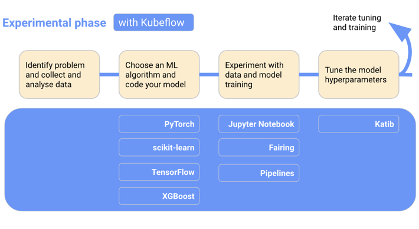
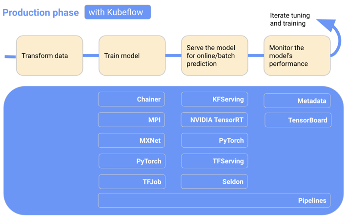

KubelowPipelines（KFP）是一个通过使用Docker容器构建和部署可移植和可扩展机器学习（ML）工作流的平台，KFP可作为Kubelow的核心组件，也可以独立安装。KFL要达成的目标是:
* 工作流 end-to-end 的编排
* 组件和 pipeline 可重用、灵活组合
* 易于管理和追踪，对 pipeline的定义、运行、experiments和ML artifacts进行可视化
* 通过缓存消除重复的执行来提升计算资源的利用率
* 通过平台无关的 IR YAML pipeline 定义达成跨平台流水线可移植性

pipeline即流水线，是一种工作流的定义，它将一个或多个组件组合在一起，形成计算有向无环图（DAG）。在运行时，每个组件执行都对应于单个容器执行，这可能会创建ML artifacts。管道也可能具有控制流的功能。

## 安装

参考链接[https://www.kubeflow.org/docs/components/pipelines/v2/installation/](https://www.kubeflow.org/docs/components/pipelines/v2/installation/)


## 组件

组件是组成KFP的组成部分，它定义输入，在body中具有用户自定义的逻辑，并生成output。当一个组件模板实例化后，被称为任务（task）.KFP提供了两种编写组件的高级方法：Python组件和容器组件。
* Python Components: 用纯Python编写组件的便捷方法，此时又有两种类型：
  * 轻量级Python组件
  * 容器化Python组件

* 容器组件: 可以使用任意容器定义来定义组件，从而提供了一种更灵活、更高级的创作方法

__Importer Components__ 是KFP提供的一种特殊的“pre-baked”组件，允许你引入一个外部生成的artifact到pipeline中。

在kubeflow整体架构中，下面两张图列出了在测试阶段和生产阶段pipeline所处的位置和作用：



## 简单实践

首先，需要通过pip命令安装kfp：`pip install kfp --pre`，然后写一个hello world pipeline：
```python
from kfp import dsl

@dsl.component
def say_hello(name: str) -> str:
  hello_text = f'Hello, {name}!'
  print(hello_text)
  return hello_text

@dsl.pipeline
def hello_pipeline(recipient: str) -> str:
  hello_task = say_hello(name=recipient)
  return hello_task.output
```
可以使用`KFP SDK DSL Compiler`将pipeline编译成YAML：
```python
from kfp import compiler

compiler.Compiler().compile(hello_pipeline, 'pipeline.yaml')
```
执行完这一步，可以看到当前路径下的pipeline文件：
```yaml
components:
  comp-say-hello:
    executorLabel: exec-say-hello
    inputDefinitions:
      parameters:
        name:
          parameterType: STRING
    outputDefinitions:
      parameters:
        Output:
          parameterType: STRING
deploymentSpec:
  executors:
    exec-say-hello:
      container:
        args:
        - --executor_input
        # ...
```
`dsl.component`和`dsl.pipeline`装饰器分别将下述带类型注解的python函数 转化成KFP component和pipeline，`KFP SDK compiler`将域特定语言（DSL）对象编译为一个hermetic pipeline YAML文件， 此时将其提交到`KFP-conformant`后端来执行，如果此前已经部署了一个KFP开源后端实例并且获得了部署的endpoint，则可以直接通过`KFP SDK Client`直接提交执行，以下内容以参数`recipient='World'`提交管道执行：
```python
from kfp.client import Client

client = Client(host='<MY-KFP-ENDPOINT>')
run = client.create_run_from_pipeline_package(
    'pipeline.yaml',
    arguments={
        'recipient': 'World',
    },
)
```
客户端将打印出一个链接用于在UI中观察pipeline的执行图和日志，在这个例程它只有1个task打印和返回`Hello, World!`。


