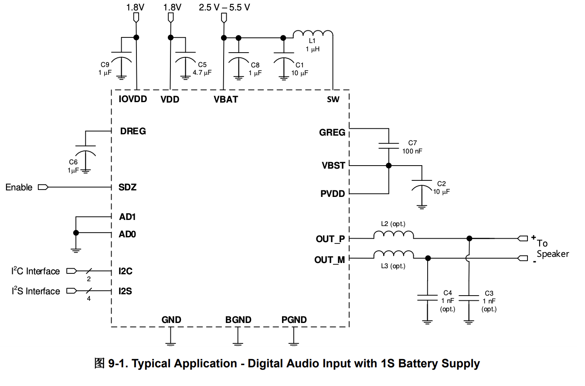
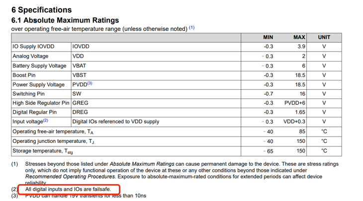
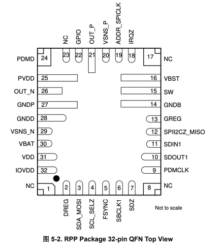
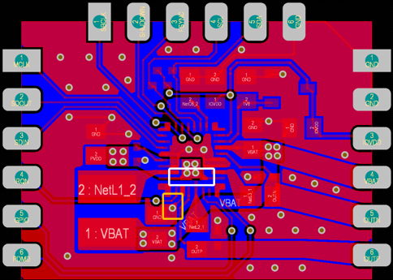
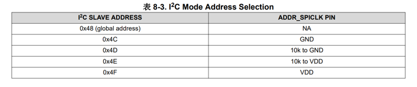
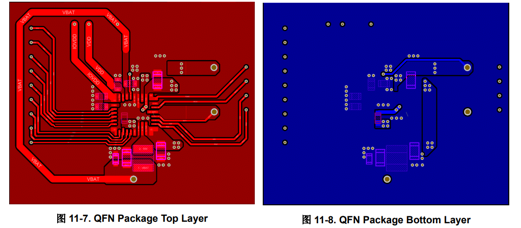
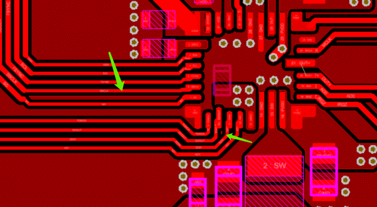
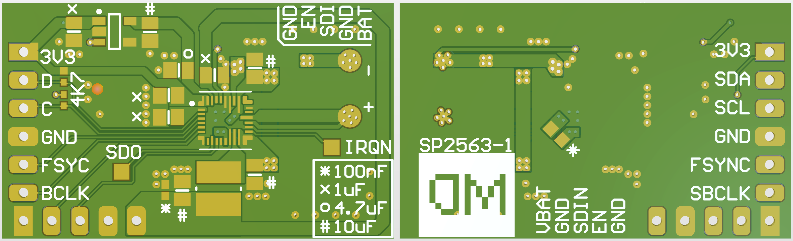

### 背景

最近想做一个小项目，对小时候玩的黑白段码屏的俄罗斯方块的游戏机进行改造，移除原有的主板，添加一颗性能强劲的芯片重新驱动这块屏幕，然后编写自己的游戏。这个游戏机是由锂电池供电，工作电压介于3.6~4.2V，由此需要为其选择一块音频功率放大芯片来驱动扬声器。

发现德州仪器tas2563非常适合这个场景，它是一款6.1W、D类数字音频功率放大器，工作电压2.5V~5.5V，集成升压器，可以将电压升至11.5V以提供足够强大的功率推动扬声器。可以将这款芯片看做两个部分，其一是升压控制部分，其二才是音频核心部分，将升压和DAC解码&功率放大集成在一起，这样一来，音频的部分就只需要一个芯片，十分便捷。

### debug记录

#### 1. 电源电压

tas2563有两种供电方式，一种是电池供电的集成升压模式，另一种是外部PVDD供电模式。后者需要额外的升压电路，不在本应用场景考虑范围之内。针对前者，官方推荐电路如下：

其中包含3路电压：
1. VBAT是功率的部分，输入给内部集成的boost升压模块。内部升压之后，由VBST即"Boost converter output"引脚输出，通过芯片外部连接，连接到PVDD即"Power stage supply"引脚。VBAT可以直连电池输出，或者USB输入；
2. VDD电压，固定为1.8V输入。其为模拟、数字和IO提供电源，可以理解为核心供电；
3. IOVDD即IO电压输入，1.8~3.3V

官方文档针对第3点有一个迷惑性的描述，在绝对最大额定值中"Input voltage"中描述"MAX"值为"VDD+0.3"：

而VDD是核心供电即1.8V，难道是说所有IO引脚输入电压不能超过2.1V？那IOVDD设置为3.3V又有什么意义呢？另外，文档中的小字注解表述所有数字输入和IO都具有故障安全（failsafe）功能，但在资料中并未找到failsafe的解释。

为了防止此芯片不支持3.3V电平，我甚至提前准备了电平转换芯片TCA9416，但经过实测，task2563支持3.3V IO电平。此前的担心属于多余了，我认为绝对最大额定值中"Input voltage"的VDD，应当是指 IOVDD。

#### 2. PCB布线

tas2563有两种封装，为了简单，这里使用qfn封装，绘制的第一版PCB（存在问题）如右图所示

此芯片为软件配置方式，在上电时，若检测到SPII2CZ_MISO引脚短接到GND，则使用IIC方式与主机通信。若使用SPI，需要使用一个电阻将此引脚上拉到IOVDD。使用IIC方式时，其从机地址通过ADDR_SPICLK引脚进行设置：

这是很有用的特性，因为2563是单声道芯片，在多声道系统中，可以通过不同的I2C地址单独配置每个芯片。

使用上述的PCB焊接成品之后，出现两个棘手问题：
1. 发现其I2C地址变成了78即0x4E，理论上应该是76即0x4C
2. 无论怎么操作，这个芯片都没有任何驱动能力

经过多天的排查，发现这些问题是PCB布局不合理造成的。针对第一个问题，ADDR_SPICLK引脚通过一个过孔连接到地，同时这个过孔也是boost电路里，电感侧的滤波电容的唯一对地回流路径，即图中橙色框内。推测在上电瞬间，sw给电感充电，因为这个过孔对地阻抗相对较高，导致ADDR_SPICLK引脚电平被拉高，核心检测到高电平使从机地址变成了0x4E。

针对第二个问题，在寄存器列表中，地址为0x02寄存器即“Power ctrl”寄存器，控制着芯片的电源状态。按照文档所述，芯片会自动检测音频信号的频率，如果格式正确，则在0x02寄存器被写0值时，进行播放。而实际上，只要写0，要么芯片会掉电重启，要么就会进入"TDM clock error"状态。

仔细分析资料，和PCB可以看出，boost升压输出引脚和PVDD引脚直接相连，并且滤波电容距离芯片较远，通过过孔翻越两次平面才连接到地，即白色框选部分。电流总会流入一条对地阻抗最小且最近的回路，主环路对地阻抗大，则带载能力就会变小。官方的demo一般都是经过详细论证和测试过的最佳实践，仔细参考官方的layout，总结以下特点：

* 走线和器件大部分置于顶层，底层尽可能保持完整
* VBST到PVDD的路径舍近求远，滤波电容放置在路径中间
* 电容接地的一侧打额外的过孔，降低阻抗
* PVDD到GREG引脚间的电容放置在芯片底部，回流路径尽可能短，并且是星型连接。GREG是boost电路高压侧栅极调节器，将PVDD引脚置于中间，可以有效跟踪PVDD的电压并进行调整

同时需要注意到，官方并没有移除死铜，说明死铜对电气性能的影响基本可以忽略。并且，电感下方的铜皮也并未做掏空处理：

根据以上规则，制作出新版的电路：

经测试已无上述问题，音色效果惊艳。

#### 3. 软件

TAS2563提供了一个灵活的TDM串行音频端口。该端口可以配置为支持多种格式，包括立体声I2S、左对齐和TDM。通过SDIN引脚，可以进行单声道音频播放。SDOUT引脚用于传输样本流，包括扬声器电压和电流感应、VBAT电压、芯片温度和通道增益。

在音频格式上，2563会自动检测time-slot的数量，有效的SBCLK到FSYNC比率为64、96、128、192、256、384和512。这里所述的time-slot，在音频通信中其实就是一帧数据中的一个通道。因为PDM接口可以传输多个声道，所以一帧数据的bit数等同于采样深度*通道数。在这里需要特别注意的是，tas2563规定小的比率为64，即每帧数据最少需要64位数据，即使传输8bit单声道音频，也要在每通道末尾补0来凑齐64位，否则会产生"TDM clock error"。

#### 4. 总结

总得来说，tas2563是一款性能优异的芯片，单芯片就解决了DAC和功率放大的需求，高达112.5 dB的SNR在官网一众扬声器放大器中可谓一骑绝尘。用它推动5.5寸的无源音箱，实际听感效果非常惊艳。当然单价是其最大的缺点，在某宝购入了2片花费160，第二天发现另外一个商家，10片250元，但即使这样，25块钱的单价依旧不便宜。